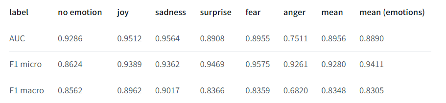

# ML System Design Doc - [RU]
## Дизайн ML системы - Tg-Chat-Analyzer / MVP / v 0.1.0

### 1. Цели и предпосылки
#### 1.1. Зачем идем в разработку продукта?

- Разработка продукта направлена на создание инструмента для анализа рабочих чатов с целью поддержания благоприятного климата в командах разработки.
- На текущем этапе оценка коммуникации внутри команды и компании происходит вручную HR и менеджерами. Часто в рабочих коллективах возникают негативные настроения, неуместные высказывания и токсичные сообщения. Борьба с этими явлениями осуществляется на основе субъективных оценок. Кроме того, постепенное развитие негативных факторов затрудняет объективное восприятие обстановки в команде. Иногда у менеджеров отсутствует возможность следить за всей рабочей перепиской. Внедрение ML в этот процесс позволит исключить субъективность оценок, охватить весь объем рабочих переписок и оперативно принимать меры для предотвращения развития негативных коммуникаций в компании.
- На первом этапе успешным результатом считаем создание обобщенного профиля для реального и живого участника в каждом чате в мессенджере Telegram. При необходимости может быть выбран адаптивный порог для оценки токсичности человека. Данная функция реализована, но порог подбирается индивидуально под запросы и требования заказчика и особенностей культуры общения в его команде.

#### 1.2. Бизнес-цель продукта
- Сократить время оценки микроклимата команды 
- Повышение производительности сотрудников 
- Выявление выгоревших\токсичных сотрудников для своевременной реакции. Чем раньше можно определить такого сотрудника, тем быстрее получится ему помочь в случае выгорания и не потерять ПШЕ или заменить его, в случае необоснованной токсичности

#### 1.3. Бизнес-требования и ограничения

- Завершение MVP рассматривается как создание удобного веб-приложения, способного загружать экспортированные чаты из Telegram и предоставлять профиль каждого сотрудника с указанием его эмоциональной окраски сообщений, склонности к токсичности и негативу.
- Проект должен быть способен работать на недорогом оборудовании, стоимость которого не должна превышать 200 тыс. рублей. В начальных этапах использование видеокарт не требуется, но при развитии проекта они могут потребоваться. Количество и стоимость видео-карт рассчитывается исходя из требований клиента и специфики организации работы внутри команды клиента, например чем больше чатов - тем сложнее задача и больше нужно ресурсов.
- Пилотный проект будет считаться успешным, когда ML метрика достигнет 80% точности классификации и когда проект пройдет период самоокупаемости и начнет приносить прибыль

### 2. Методология `Data Scientist`

- С точки зрения ML, целью является классификация текстов по нескольким параметрам: эмоциональная окраска, неуместность высказываний, склонность к негативу и общая токсичность сообщений.

### 3. Подготовка пилота

- Оценка пилота включает в себя удобный пользовательский опыт и высокую скорость работы (время отклика программы). Удобство пользовательского опыта будет оценено с помощью ручного тестирования и сбора обратной связи. Пилотный проект должен эффективно решать поставленные перед ним задачи.

### 4. Внедрение в production

- Деплой будет осуществляться на отдельный сервер, настроенный с использованием Nginx. Для обеспечения безопасности и управления трафиком, будет использоваться Cloudflare, который также обеспечит привязку к доменному имени.

### 5. Разработка

- В качестве ключевой модели в рамках проекта использована нейронная сеть `Bert`, она классифицирует предложения. Всего используется 6 основных классов для предложений: *"Нейтральность", "Радость", "Грусть", "Удивление", "Страх", "Гнев"*
- Пилотная версия поддерживает русский и английский языки, язык определяется с помощью модели `roberta`
- Подробнее о моделях:
1. **Эмоции** классифицируются на основе мультиклассовой модели https://huggingface.co/cointegrated/rubert-tiny2-cedr-emotion-detection. Модель была обучена на наборе данных CEDR с помощью оптимизатора Adam в течение 40 эпох со скоростью обучения 1e-5 и размером батча 64

2. **Неуместные высказывания** классифицируются на основе модели https://huggingface.co/apanc/russian-inappropriate-messages. Эта модель обучена на наборе данных недопустимых сообщений русского языка. Как правило, неуместным высказыванием считается высказывание, которое не содержит нецензурных слов или каких-либо токсичных намерений, но все же может нанести вред репутации говорящего. Пример:
 и метрики работы модели
   
   
3. **Чувствительные темы** обрабатываются с помощью модели https://huggingface.co/MonoHime/rubert-base-cased-sentiment-new
4. **Токсичные сообщения** классифицируются с помощью модели https://huggingface.co/cointegrated/rubert-tiny-toxicity
Данная модель обучена на наборе данных https://cups.online/ru/tasks/1048

### 6. Нагрузочное тестирование
- Тестирование будет проводиться по разным аспектам: количество символов в сообщении, количество сообщений в одном блоке и тд.

### 7. Пример работы сервиса
- В качестве пилотной версии было разработано API, к которому можно отправлять запросы. Сами запросы представляют из себя сообщения из произвольного рабочего чата

- В качестве выходных данных мы получаем вероятность от 0 до 1, которая показывает, насколько сообщение относится к одному из 9 представленных классов. 1 в нашем случае это полная уверенность в классе, например мы на 100% уверены, что сообщение токсично 

- Скорость обработки одного сообщения занимается в среднем 3 миллисекунды. Данная версия не требует GPU и поддерживает такую скорость на процессоре RYZEN 4600H

- При необходимости развернуть модель на своем железе можно воспользоваться docker:
`docker run -dit -p 8000:8000 germanleontiev/profiles-mlsd`
  

### 8. Планируемое развитие системы
- Поддержка большего количества языков
- Повышение точности работы классификатора для русского языка. Для этого нужна организация вручную размеченных данных и сами пользовательские данные
- В плане масштабирования системы вход: развертка системы на сервере с GPU, увеличение количества языков обработки системы. На текущем этапе узким местом системы является количество обрабтанных сообщений. Если необходимо будет следить за 100+ чатами с непрерывным поток общения в 50 человек, то система работу в реальном времени поддерживать не сможет